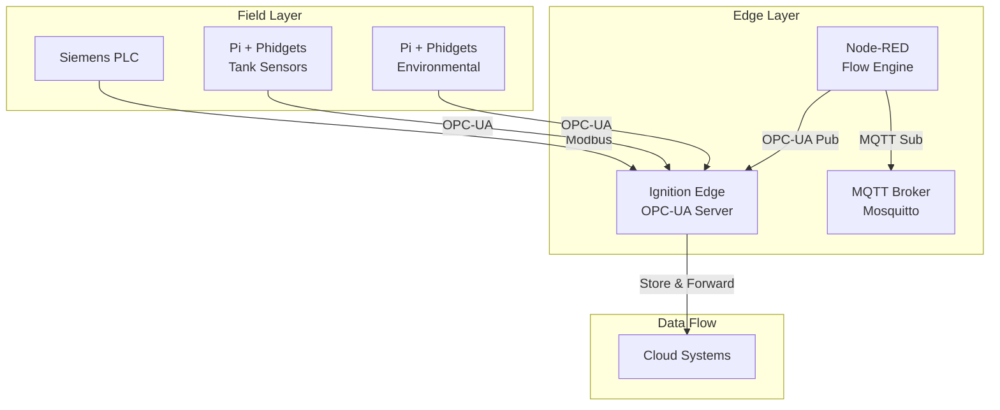

# Steel Bonnet Brewery IIoT Integration Guide

## Overview
This guide unifies the Industrial IoT stack for Steel Bonnet brewery, bringing together Ignition Edge, Node-RED, MQTT, and Raspberry Pi edge nodes with Phidget sensors. The architecture follows UNS (Unified Namespace) principles for data organization.

## Architecture Summary



## UNS Hierarchy Structure

Based on your equipment mapping configuration, the UNS structure for Steel Bonnet:

```
SteelBonnet/
├── Brewery/
│   ├── ColdSide/
│   │   ├── Fermenters/
│   │   │   ├── FV1/
│   │   │   │   ├── Temperature
│   │   │   │   ├── Pressure
│   │   │   │   └── Status
│   │   │   └── FV2/
│   │   ├── BrightTanks/
│   │   │   └── BT1/
│   │   └── GlycolSystem/
│   │       ├── Chiller/
│   │       └── Pumps/
│   ├── HotSide/
│   │   ├── MashTun/
│   │   ├── Boiler/
│   │   └── HeatExchanger/
│   └── Utilities/
│       ├── AirCompressor/
│       ├── WalkInChiller/
│       └── CIP/
```

## Component Integration Points

### 1. Ignition Edge Configuration

**Key Considerations for Jython 2.7:**
- No f-strings, use `.format()` or `%` formatting
- Import restrictions in Edge environment
- Limited library availability

**UDT Structure (from your udtFactory_unified.py):**
```python
# Base I/O Types (Building Blocks)
- analog_input (temperature, pressure, flow, level)
- digital_input (status, alarms)
- analog_output (control valves, VFDs)
- digital_output (on/off controls)

# Equipment Types (Nested UDTs)
- pump (with nested analog/digital I/O)
- tank (with level, temperature)
- valve (with position feedback)
- air_compressor
- glycol_chiller
- boiler
```

### 2. Node-RED Integration Patterns

**MQTT to OPC-UA Bridge Flow:**
```javascript
// Process MQTT data and publish to OPC-UA
msg.payload = {
    nodeId: "ns=2;s=SteelBonnet/Brewery/ColdSide/FV1/Temperature",
    value: msg.payload.temperature,
    dataType: "Float",
    timestamp: new Date()
};
return msg;
```

**Key Node-RED Flows (from your repository):**
- `ignition_opc_config_flow.json` - OPC-UA configuration
- `opc_connection_manager.json` - Connection management
- `equipment_simulator_flow.json` - Testing and validation

### 3. Pi + Phidget Edge Nodes

**Deployment Architecture:**
- Each Pi handles specific area/equipment
- Direct OPC-UA publishing to Ignition Edge
- Local buffering for network resilience
- Node-RED on Pi for edge processing

**Sensor Mapping Example:**
```
Pi-Edge-001 (Fermentation Area):
├── VINT Port 0: FV1 Temperature/Humidity
├── VINT Port 1: FV2 Temperature/Humidity  
├── VINT Port 2: Glycol Supply Temperature
└── VINT Port 3: Glycol Return Temperature

Pi-Edge-002 (Utilities):
├── VINT Port 0: Compressor Room Temp/Humidity
├── VINT Port 1: Walk-in Chiller Temp
└── VINT Port 2: Ambient Conditions
```

## Implementation Roadmap

### Phase 1: Core Infrastructure (Current)
- [x] Ignition Edge with UDTs deployed
- [x] Node-RED flows for MQTT/OPC bridging
- [x] Basic PLC connectivity via Modbus
- [ ] Deploy first Pi edge node

### Phase 2: Sensor Integration
- [ ] Install Pi units in key locations
- [ ] Configure Phidget sensors
- [ ] Establish OPC-UA connections
- [ ] Implement local data buffering

### Phase 3: Data Processing
- [ ] Deploy edge analytics on Pi units
- [ ] Implement alarm management
- [ ] Create operational dashboards
- [ ] Set up historian connections

### Phase 4: Optimization
- [ ] Performance tuning
- [ ] Redundancy implementation
- [ ] Advanced analytics
- [ ] Mobile interfaces

## Testing Strategy

### 1. Component Testing
```bash
# Test Phidget connectivity
python3 /home/pi/edge-node/phidget_device_test.py

# Test OPC-UA publishing
python3 test_opcua_client.py

# Validate MQTT topics
mosquitto_sub -t "SteelBonnet/+/+/+/#" -v
```

### 2. Integration Testing
- Use Node-RED simulator flows for equipment validation
- Test store & forward during network outages
- Verify alarm propagation through all layers

### 3. Jython 2.7 Compatibility Testing
```python
# Test UDT creation in Ignition script console
udtFactory_unified.deploy_all_udts()

# Validate tag creation
mqttOrchestration_unified.handle_mqtt_registration({
    "name": "Test_Pump_001",
    "type": "pump",
    "area": "Utilities"
})
```

## Security Considerations

1. **Network Segmentation**
   - Isolate OT network from IT
   - Use VLANs for different areas
   - Firewall rules for OPC-UA/MQTT

2. **Authentication**
   - OPC-UA certificates
   - MQTT username/password
   - Node-RED admin authentication

3. **Data Integrity**
   - TLS for MQTT communications
   - Signed OPC-UA messages
   - Local data validation

## Monitoring and Maintenance

### Health Checks
- Pi edge node monitoring (CPU, memory, network)
- Phidget sensor status validation
- OPC-UA connection monitoring
- MQTT broker statistics

### Backup Strategy
- Ignition gateway backups
- Node-RED flow exports
- Pi configuration snapshots
- UDT definitions versioning

## Next Steps

1. **Review and validate** UNS structure against your brewery layout
2. **Deploy first Pi edge node** in fermentation area
3. **Test end-to-end data flow** from Phidget → Pi → OPC-UA → Ignition
4. **Create monitoring dashboard** in Ignition
5. **Document operational procedures** for your team

## Resources
- [Ignition Edge Documentation](./stack-components/ignition-edge/)
- [Node-RED Technical Reference](./stack-components/node-red/technical-reference.md)
- [Pi + Phidget Integration](./stack-components/edge-computing/pi-phidget-integration.md)
- [Steel Bonnet Repository](./Steel_Bonnet/)