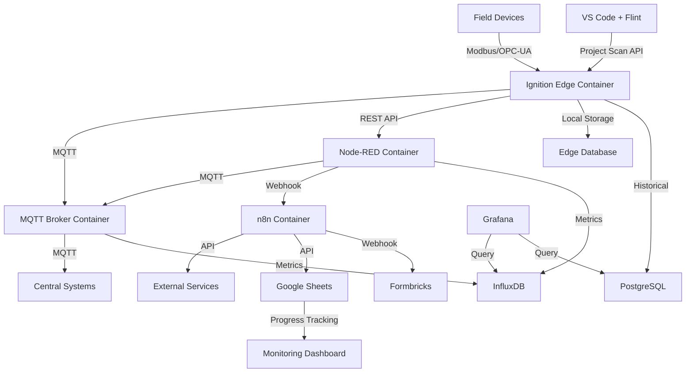

# Industrial IoT Stack Overview

*Last Updated: June 1, 2025*

## 🎯 Strategic Update: Docker Migration in Progress
**New Direction**: Moving to Docker-based deployment on dedicated server with Tailscale access for improved reliability and modular architecture. See [DOCKER_MIGRATION_STRATEGY.md](./DOCKER_MIGRATION_STRATEGY.md) for details.

## Stack Architecture

## Component Summary

### 🔧 Ignition Edge
**Status**: 🟢 Active  
**Purpose**: Edge data collection and local HMI  
[Full Documentation](./stack-components/ignition-edge/README.md)

**Key Capabilities**:
- Modbus/OPC-UA device connectivity
- Local operator interfaces
- Edge data processing
- Store & forward for reliability

---

### 🔴 Node-RED
**Status**: 🟢 Active  
**Purpose**: Flow-based integration and automation  
[Full Documentation](./stack-components/node-red/README.md)

**Key Capabilities**:
- Visual programming for integrations
- Protocol transformation
- Business logic implementation
- Third-party API connectivity

---

### 🔵 n8n
**Status**: 🔵 Planned  
**Purpose**: Advanced workflow automation and business logic  
[Full Documentation](./stack-components/n8n/README.md)

**Key Capabilities**:
- Complex multi-step workflows
- 350+ native integrations
- Human-in-the-loop processes
- Advanced error handling
- Scheduled jobs and reporting

---

### 📊 Grafana
**Status**: 🔵 Planned  
**Purpose**: Real-time visualization and monitoring dashboards  
[Full Documentation](./stack-components/grafana/README.md)

**Key Capabilities**:
- Real-time production dashboards
- Historical trending and analysis
- Multi-source data visualization
- Mobile-responsive interfaces
- Alerting and notifications
- OEE and KPI tracking

---

### 📡 MQTT Infrastructure
**Status**: 🟡 Partial  
**Purpose**: Messaging backbone for IIoT data  
[Full Documentation](./stack-components/mqtt/README.md)

**Key Capabilities**:
- Publish/subscribe messaging
- Quality of Service guarantees
- Topic-based data organization
- Lightweight protocol for edge devices

---

## Integration Matrix

| Component | Sends To | Receives From | Protocol |
|-----------|----------|---------------|----------|
| Ignition Edge | MQTT Broker, Node-RED | Field Devices | MQTT, REST |
| Node-RED | MQTT Broker, Databases | Ignition Edge, MQTT | MQTT, HTTP |
| MQTT Broker | All subscribers | All publishers | MQTT |

## Current Implementation Status

### Overall Stack Health: 75%

- ✅ **Core Infrastructure**: Operational
- ✅ **Device Connectivity**: Working for Modbus devices
- 🚧 **Data Pipeline**: MQTT partially configured
- 📋 **Analytics**: Planned for Q3 2025
- 📋 **Cloud Integration**: Under design

## 🐳 Docker Migration Status

### Migration Components
- **Ignition + Flint**: Docker Compose configuration ready
- **Node-RED**: Existing container to be integrated
- **MQTT Infrastructure**: Mosquitto in container
- **Monitoring Stack**: Portainer + Grafana planned
- **Progress Tracking**: Google Sheets integration active

### Access Methods
- **Primary**: SSH via Tailscale to server
- **Management**: TMUX sessions for persistent access
- **Monitoring**: Google Sheets dashboard for real-time status
- **Development**: VS Code + Flint for remote project editing

## 📊 Progress Tracking

### Google Sheets Integration
- **Master Tracker**: Real-time progress visibility
- **Automated Updates**: 5-minute sync intervals
- **Mobile Access**: Monitor from anywhere
- **Team Collaboration**: Shared view of all activities

### Quick Setup
1. Copy `scripts/google_sheets_setup.gs` to new Google Sheet
2. Run `setupProgressTracker()` function
3. Configure automation scripts
4. See [GOOGLE_SHEETS_QUICK_SETUP.md](./GOOGLE_SHEETS_QUICK_SETUP.md)

## Quick Links

- [Docker Migration Strategy](./DOCKER_MIGRATION_STRATEGY.md)
- [Google Sheets Progress Tracker](./GOOGLE_SHEETS_PROGRESS_TRACKER.md)
- [Component Templates](./templates/component-template.md)
- [Steel Bonnet Scripts Repository](https://github.com/slimstrongarm/Steel_Bonnet)
- [Deployment Guide](./docs/deployment.md)
- [Troubleshooting Guide](./docs/troubleshooting.md)

## How to Update This Documentation

1. Edit component documentation in `stack-components/[component]/`
2. Run aggregation script: `./scripts/aggregate-docs.sh`
3. Commit and push changes

## Next Review Date: June 15, 2025