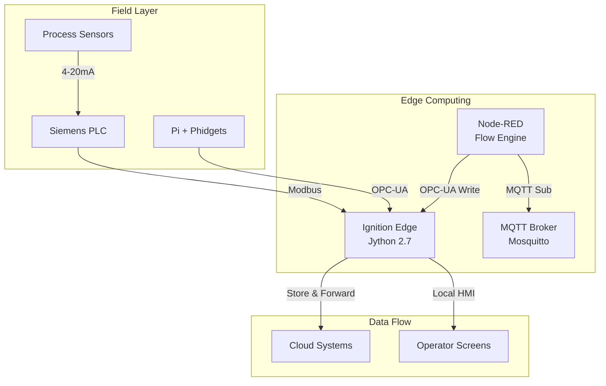

# Industrial IoT Stack Overview

*Last Updated: May 30, 2025*

## Stack Architecture

## Component Summary

### 🔧 Ignition Edge
**Status**: 🟢 Active  
**Purpose**: Edge data collection, OPC-UA server, and local HMI  
[Full Documentation](./stack-components/ignition-edge/README.md)

**Key Capabilities**:
- Modbus device connectivity (Siemens PLC)
- OPC-UA server for Pi edge nodes
- UDT-based equipment modeling
- Store & forward for reliability
- Jython 2.7 scripting (Note: legacy Python version)

---

### 🔴 Node-RED
**Status**: 🟢 Active  
**Purpose**: MQTT to OPC-UA bridge and flow automation  
[Full Documentation](./stack-components/node-red/README.md)

**Key Capabilities**:
- MQTT topic subscription and processing
- OPC-UA tag creation in Ignition
- Equipment registration workflows
- Data validation and transformation
- Edge deployment on Raspberry Pi

---

### 📡 MQTT Infrastructure
**Status**: 🟢 Active  
**Purpose**: Messaging backbone for legacy device integration  
[Full Documentation](./stack-components/mqtt/README.md)

**Key Capabilities**:
- Mosquitto broker deployment
- UNS-structured topic hierarchy
- QoS 1 for reliable delivery
- Bridge to OPC-UA via Node-RED
- Quarantine area for non-standard devices

---

## Integration Matrix

| Component | Sends To | Receives From | Protocol |
|-----------|----------|---------------|----------|
| Ignition Edge | MQTT Broker, Node-RED | Field Devices | MQTT, REST |
| Node-RED | MQTT Broker, Databases | Ignition Edge, MQTT | MQTT, HTTP |
| MQTT Broker | All subscribers | All publishers | MQTT |

## Current Implementation Status

### Overall Stack Health: 85%

- ✅ **Core Infrastructure**: Operational
- ✅ **Device Connectivity**: Siemens PLC via Modbus active
- ✅ **MQTT Bridge**: Node-RED flows deployed
- ✅ **UDT Structure**: Brewery equipment models defined
- 🚧 **Edge Nodes**: Pi + Phidget integration ready for deployment
- 📋 **Production Deployment**: Pending field installation

## Quick Links

- [Component Templates](./templates/component-template.md)
- [Steel Bonnet Scripts Repository](https://github.com/slimstrongarm/Steel_Bonnet)
- [Deployment Guide](./docs/deployment.md)
- [Troubleshooting Guide](./docs/troubleshooting.md)

## How to Update This Documentation

1. Edit component documentation in `stack-components/[component]/`
2. Run aggregation script: `./scripts/aggregate-docs.sh`
3. Commit and push changes

## Next Review Date: June 15, 2025