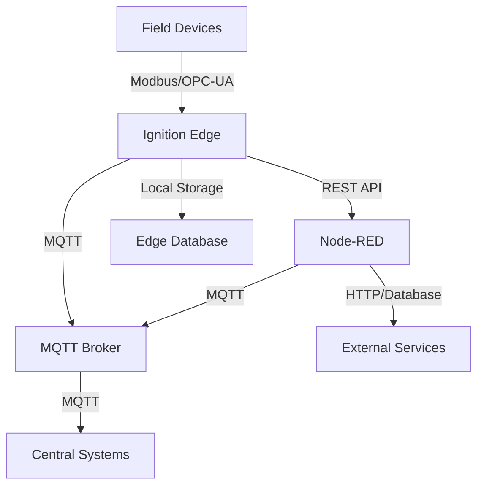

# Industrial IoT Stack Overview

*Last Updated: May 30, 2025*

## Stack Architecture

## Component Summary

### 🔧 Ignition Edge
**Status**: 🟢 Active  
**Purpose**: Edge data collection and local HMI  
[Full Documentation](./stack-components/ignition-edge/README.md)

**Key Capabilities**:
- Modbus/OPC-UA device connectivity
- Local operator interfaces
- Edge data processing
- Store & forward for reliability

---

### 🔴 Node-RED
**Status**: 🟢 Active  
**Purpose**: Flow-based integration and automation  
[Full Documentation](./stack-components/node-red/README.md)

**Key Capabilities**:
- Visual programming for integrations
- Protocol transformation
- Business logic implementation
- Third-party API connectivity

---

### 📡 MQTT Infrastructure
**Status**: 🟡 Partial  
**Purpose**: Messaging backbone for IIoT data  
[Full Documentation](./stack-components/mqtt/README.md)

**Key Capabilities**:
- Publish/subscribe messaging
- Quality of Service guarantees
- Topic-based data organization
- Lightweight protocol for edge devices

---

## Integration Matrix

| Component | Sends To | Receives From | Protocol |
|-----------|----------|---------------|----------|
| Ignition Edge | MQTT Broker, Node-RED | Field Devices | MQTT, REST |
| Node-RED | MQTT Broker, Databases | Ignition Edge, MQTT | MQTT, HTTP |
| MQTT Broker | All subscribers | All publishers | MQTT |

## Current Implementation Status

### Overall Stack Health: 75%

- ✅ **Core Infrastructure**: Operational
- ✅ **Device Connectivity**: Working for Modbus devices
- 🚧 **Data Pipeline**: MQTT partially configured
- 📋 **Analytics**: Planned for Q3 2025
- 📋 **Cloud Integration**: Under design

## Quick Links

- [Component Templates](./templates/component-template.md)
- [Steel Bonnet Scripts Repository](https://github.com/slimstrongarm/Steel_Bonnet)
- [Deployment Guide](./docs/deployment.md)
- [Troubleshooting Guide](./docs/troubleshooting.md)

## How to Update This Documentation

1. Edit component documentation in `stack-components/[component]/`
2. Run aggregation script: `./scripts/aggregate-docs.sh`
3. Commit and push changes

## Next Review Date: June 15, 2025