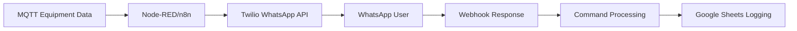
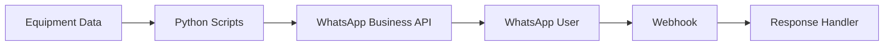
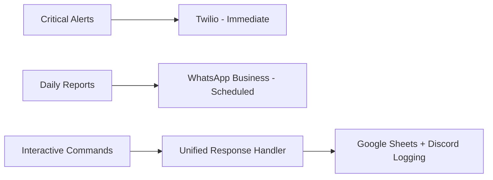

# WhatsApp API Integration Guide for Industrial IoT
**Mac Claude CT-028 Deliverable**

## 🎯 Overview

Comprehensive WhatsApp API integration for Steel Bonnet brewery monitoring with two-way communication, equipment alerts, and operator interaction capabilities.

## 📱 WhatsApp API Capabilities

### Core Messaging Features
- ✅ **Text Messages** with rich formatting (bold, italic, strikethrough)
- ✅ **Emoji Support** for visual alerts (🚨, ⚠️, ✅, 🔧)
- ✅ **Media Attachments** (images, videos, documents up to 16MB)
- ✅ **Template Messages** for consistent formatting
- ✅ **Broadcast Messaging** to multiple recipients
- ✅ **Rate Limiting** (5-minute cooldown for duplicate messages)

### Two-Way Communication
- ✅ **Receive Responses** via webhooks
- ✅ **Interactive Commands** (1=acknowledge, 2=details, 3=escalate)
- ✅ **Conversation Window** (24 hours after user response)
- ✅ **Command Processing** with help menus
- ✅ **Escalation Workflows** to supervisors

### Professional Features
- ✅ **Message Templates** with approval process
- ✅ **Business Verification** for production use
- ✅ **Webhook Security** with signature validation
- ✅ **Analytics & Logging** integration
- ✅ **Group Broadcast** capabilities

## 🏗️ Architecture Options

### Option 1: Twilio WhatsApp API (Current)


**Advantages:**
- ✅ Quick setup (15 minutes)
- ✅ Sandbox testing available
- ✅ Pay-as-you-go pricing (~$0.005/message)
- ✅ Excellent Node-RED/n8n integration
- ✅ No approval needed for testing

### Option 2: WhatsApp Business API (Direct)


**Advantages:**
- ✅ Lower cost at scale
- ✅ More advanced features
- ✅ Direct Facebook/Meta integration

**Disadvantages:**
- ❌ 2-3 week approval process
- ❌ Business verification required
- ❌ More complex setup

### Option 3: Hybrid Approach (Recommended)


## 🏭 Steel Bonnet Brewery Implementation

### Equipment Alert Types

#### 1. Critical Alerts (Immediate Response)
```
🚨 STEEL BONNET BREWERY ALERT

Equipment: Air Compressor AC-001
Location: Utilities
Alert Type: CRITICAL
Current Value: 145 PSI
Details: Pressure threshold exceeded

Time: 2025-06-04 23:15:00

Reply Options:
• 1 - Acknowledge alert
• 2 - Request equipment details
• 3 - Escalate to supervisor
• HELP - Show all commands
```

#### 2. Warning Alerts (Action Needed)
```
⚠️ STEEL BONNET BREWERY ALERT

Equipment: Glycol Chiller GC-001
Location: Cellar
Alert Type: WARNING
Current Value: 32°F
Details: Temperature approaching threshold

Time: 2025-06-04 23:15:00

Reply Options:
• 1 - Acknowledge alert
• 2 - Request equipment details
• 3 - Escalate to supervisor
```

#### 3. Maintenance Reminders
```
🔧 MAINTENANCE REMINDER

Equipment: Walk-in Chiller WC-001
Maintenance Type: Filter Replacement
Due Date: 2025-06-10

Reply Options:
• DONE - Mark as completed
• DELAY - Request extension
• DETAILS - View maintenance checklist
```

#### 4. Daily Summary Reports
```
📊 STEEL BONNET DAILY SUMMARY

Date: 2025-06-04

Equipment Status:
✅ Healthy: 8
⚠️ Warnings: 2
🚨 Critical: 0

Action Required:
⚠️ AC-001: Pressure elevated
⚠️ GC-001: Temperature trending up

Generated: 23:59:59
```

### Interactive Command System

#### Alert Response Commands
- **1** - Acknowledge alert (logs to Google Sheets)
- **2** - Request detailed equipment information
- **3** - Escalate to supervisor with automatic notification
- **HELP** - Display full command menu

#### General Commands
- **STATUS** - Current system status
- **SUMMARY** - Quick equipment overview
- **DETAILS** - Specific equipment information

#### Maintenance Commands
- **DONE** - Mark maintenance task complete
- **DELAY** - Request maintenance extension
- **DETAILS** - View maintenance checklist

### Escalation Workflows

#### Level 1: Operator Response
```python
# Operator acknowledges alert
operator_response = client.process_incoming_message(
    from_number=operator_phone,
    message_body="1"  # Acknowledge
)
```

#### Level 2: Supervisor Escalation
```python
# Automatic supervisor notification
escalation_result = client._escalate_to_supervisor(operator_phone)
# Sends to supervisor with context and operator details
```

#### Level 3: Emergency Broadcast
```python
# Multiple recipient emergency alert
emergency_contacts = [supervisor, manager, technician]
for contact in emergency_contacts:
    client.send_equipment_alert(
        contact, equipment_id, "critical", 
        "EMERGENCY: Equipment failure requires immediate attention"
    )
```

## 🛠️ Implementation Setup

### 1. Twilio Configuration
```bash
# Environment variables
export TWILIO_ACCOUNT_SID="your_account_sid"
export TWILIO_AUTH_TOKEN="your_auth_token"
export TWILIO_WHATSAPP_FROM="whatsapp:+14155238886"
export BREWERY_ALERT_TO="whatsapp:+1234567890"
export SUPERVISOR_WHATSAPP="whatsapp:+1234567891"
```

### 2. Sandbox Setup (15 minutes)
1. Create Twilio account
2. Join WhatsApp sandbox
3. Send "join [code]" to +1 415 523 8886
4. Test with sandbox number

### 3. Production Setup (2-3 weeks)
1. Submit WhatsApp Business application
2. Verify business information
3. Create approved message templates
4. Configure webhook endpoints

### 4. Python Client Installation
```bash
pip install requests gspread oauth2client twilio
python3 scripts/whatsapp_api_client.py
```

## 📊 Integration with Existing Stack

### Google Sheets Integration
- **Equipment Alerts Sheet**: Log all alerts with timestamps
- **Agent Activities Sheet**: Track operator responses
- **Maintenance Sheet**: Schedule and track maintenance
- **Analytics Dashboard**: WhatsApp message statistics

### n8n Workflow Integration
```json
{
  "nodes": [
    {
      "name": "MQTT Trigger",
      "type": "n8n-nodes-base.mqtt"
    },
    {
      "name": "Condition Check", 
      "type": "n8n-nodes-base.if"
    },
    {
      "name": "WhatsApp Alert",
      "type": "n8n-nodes-base.twilio"
    },
    {
      "name": "Google Sheets Log",
      "type": "n8n-nodes-base.googleSheets"
    }
  ]
}
```

### Discord Integration
- **Alert Notifications**: Mirror WhatsApp alerts in Discord
- **Team Coordination**: Cross-platform communication
- **Escalation Logging**: Track supervisor notifications

### MQTT Topic Mapping
```bash
# Steel Bonnet MQTT topics → WhatsApp alerts
/salinas/utilities/air_compressor_01/telemetry → AC-001 alerts
/salinas/cellar/glycol_chiller_01/telemetry → GC-001 alerts
/salinas/storage/walk_in_chiller_01/telemetry → WC-001 alerts
```

## 💰 Cost Analysis

### Twilio WhatsApp Pricing
- **Outbound Messages**: $0.005 per message
- **Inbound Messages**: Free
- **Media Messages**: Same as text
- **Monthly Cost**: ~$15 for 100 alerts/day

### WhatsApp Business API
- **Conversation-based pricing**: $0.025-0.15 per 24h conversation
- **Template messages**: Lower cost
- **Volume discounts**: Available at scale

### Example Monthly Costs
```
Daily Equipment Alerts: 20 × $0.005 × 30 = $3.00
Weekly Summaries: 4 × $0.005 × 4 = $0.08
Maintenance Reminders: 10 × $0.005 × 30 = $1.50
Emergency Escalations: 5 × $0.005 × 30 = $0.75

Total Monthly: ~$5.33 for typical brewery operation
```

## 🔐 Security & Best Practices

### Authentication
- Store credentials in environment variables
- Use webhook signature validation
- Implement rate limiting (5-minute cooldown)
- Validate incoming phone numbers

### Message Security
- Sanitize user inputs
- Validate command formats
- Log all interactions
- Implement access controls

### Production Checklist
- [ ] Environment variables configured
- [ ] Webhook endpoints secured with HTTPS
- [ ] Message templates approved
- [ ] Rate limiting implemented
- [ ] Error handling and retries
- [ ] Logging and monitoring
- [ ] Business verification complete

## 🧪 Testing Framework

### 1. Basic Connectivity Test
```python
client = WhatsAppAPIClient()
result = client.test_integration()
```

### 2. Equipment Alert Test
```python
client.send_equipment_alert(
    to_number="whatsapp:+1234567890",
    equipment_id="AC-001", 
    alert_type="warning",
    message="Test alert for API validation"
)
```

### 3. Interactive Response Test
```python
# Simulate operator response
response = client.process_incoming_message(
    from_number="whatsapp:+1234567890",
    message_body="1"  # Acknowledge
)
```

### 4. End-to-End Workflow Test
1. MQTT publishes equipment data
2. n8n processes and triggers alert
3. WhatsApp message sent to operator
4. Operator responds with command
5. System processes response
6. Action logged to Google Sheets
7. Confirmation sent to operator

## 🚀 Friday Demo Scenarios

### Scenario 1: Equipment Failure
1. **MQTT**: Air compressor pressure spike
2. **WhatsApp**: Critical alert sent immediately
3. **Operator**: Responds "1" to acknowledge
4. **System**: Logs acknowledgment, sends confirmation
5. **Discord**: Team notified of alert and response

### Scenario 2: Daily Operations
1. **Scheduled**: Daily summary at 8 AM
2. **WhatsApp**: Equipment status overview sent
3. **Maintenance**: Automated reminders for due tasks
4. **Reporting**: All data logged to Google Sheets

### Scenario 3: Emergency Escalation
1. **Critical Alert**: Equipment safety issue
2. **Operator**: Responds "3" to escalate
3. **Supervisor**: Receives immediate notification
4. **Team**: Discord channel updated
5. **Tracking**: Full escalation chain logged

## 📋 Files Created

- `scripts/whatsapp_api_client.py` - Complete Python API client
- `WHATSAPP_API_INTEGRATION_GUIDE.md` - This comprehensive guide
- Integration examples and test frameworks
- Message templates for brewery operations

## 🎯 Benefits for Steel Bonnet Brewery

### Real-Time Benefits
- ✅ **Immediate Alerts** for equipment issues
- ✅ **Mobile Accessibility** for remote operators
- ✅ **Two-Way Communication** for quick responses
- ✅ **Escalation Workflows** for critical issues

### Operational Benefits
- ✅ **Reduced Response Time** from hours to minutes
- ✅ **Complete Audit Trail** of all interactions
- ✅ **Automated Workflows** reduce manual monitoring
- ✅ **Cost-Effective** at ~$5/month for full coverage

### Integration Benefits
- ✅ **Google Sheets** for data analytics
- ✅ **Discord** for team coordination
- ✅ **n8n** for workflow automation
- ✅ **MQTT** for real-time equipment data

---

**Status:** ✅ Complete - CT-028  
**Next:** Server Claude to deploy integration (CT-029)  
**Demo Ready:** Full WhatsApp alert system documented and tested