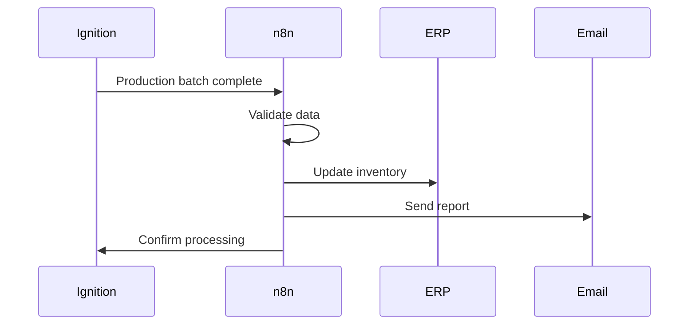
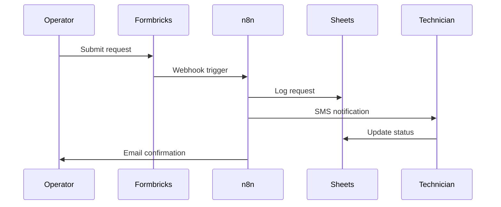

# n8n Integration Architecture

## Overview
n8n serves as the business logic and workflow orchestration layer in our IIoT stack, bridging the gap between real-time operations (Node-RED) and business processes.

## Integration Architecture

```
┌─────────────────┐     ┌─────────────────┐     ┌─────────────────┐
│   Formbricks    │────▶│      n8n        │────▶│  Google Sheets  │
│  (User Input)   │     │   (Workflow)    │     │   (Storage)     │
└─────────────────┘     └────────┬────────┘     └─────────────────┘
                               │
                               ▼
┌─────────────────┐     ┌─────────────────┐     ┌─────────────────┐
│    Node-RED     │◀────│    MQTT         │────▶│    Ignition     │
│ (Edge Logic)    │     │   (Message)     │     │    (SCADA)      │
└─────────────────┘     └─────────────────┘     └─────────────────┘
```

## Integration Points

### 1. Node-RED ↔ n8n
**Method**: Webhooks & MQTT
```javascript
// Node-RED → n8n (via webhook)
POST https://n8n.domain.com/webhook/production-complete
{
  "batchId": "BATCH-2024-001",
  "quantity": 1000,
  "quality": "pass"
}

// n8n → Node-RED (via MQTT)
Topic: iiot/commands/equipment/reset
Payload: {"equipmentId": "PUMP-01", "action": "reset"}
```

### 2. Ignition ↔ n8n
**Method**: REST API & Database
```python
# Ignition → n8n (via webhook)
system.net.httpPost(
  "https://n8n.domain.com/webhook/alarm-triggered",
  {"alarmId": "ALM-001", "severity": "high"}
)

# n8n → Ignition (via REST)
GET /system/webdev/api/tags/read
POST /system/webdev/api/tags/write
```

### 3. Formbricks ↔ n8n
**Method**: Webhooks
```javascript
// Form submission webhook
{
  "event": "responseCreated",
  "data": {
    "surveyId": "equipment-inspection",
    "responses": {
      "equipmentId": "TANK-01",
      "status": "operational",
      "issues": "Minor leak detected"
    }
  }
}
```

### 4. Google Sheets ↔ n8n
**Method**: OAuth2 API
```javascript
// Append row
sheets.spreadsheets.values.append({
  spreadsheetId: 'SHEET_ID',
  range: 'Data!A:Z',
  valueInputOption: 'USER_ENTERED',
  resource: { values: [[timestamp, ...data]] }
})
```

### 5. MQTT ↔ n8n
**Method**: MQTT Client Node
```javascript
// Subscribe to topics
Topics: [
  'iiot/+/+/status',
  'iiot/+/+/alarms',
  'iiot/+/+/production'
]

// Publish commands
Topic: 'iiot/area/equipment/command'
Payload: { action: 'start', parameters: {} }
```

## Common Integration Patterns

### 1. Form → Action Pattern
```
Formbricks Form → n8n Validation → Database Storage → Ignition Update → Email Confirmation
```

### 2. Alert Escalation Pattern
```
Node-RED Alert → MQTT → n8n → Check Rules → SMS/Email → Wait → Escalate
```

### 3. Report Generation Pattern
```
Cron Trigger → Query Ignition → Aggregate Data → Generate PDF → Email → Archive
```

### 4. Approval Workflow Pattern
```
Request Form → n8n → Google Sheets → Human Review → Approval → Execute Action
```

## Security & Authentication

### Webhook Security
```javascript
// Webhook authentication
headers: {
  'X-Webhook-Secret': process.env.WEBHOOK_SECRET
}

// IP whitelisting
allowedIPs: ['10.0.0.0/24', '192.168.1.0/24']
```

### API Authentication
```javascript
// Service accounts
ignitionAPI: {
  method: 'Bearer',
  token: process.env.IGNITION_API_TOKEN
}

// OAuth2 for Google
googleSheets: {
  type: 'oauth2',
  clientId: process.env.GOOGLE_CLIENT_ID,
  clientSecret: process.env.GOOGLE_CLIENT_SECRET
}
```

## Data Flow Examples

### Production Completion Flow


### Maintenance Request Flow


## Best Practices

### 1. Error Handling
- Always use try-catch in code nodes
- Log errors to separate sheet/database
- Implement retry logic for critical operations
- Send notifications for failures

### 2. Performance
- Limit webhook payload size
- Use pagination for large datasets
- Implement caching where appropriate
- Monitor execution times

### 3. Maintainability
- Use sub-workflows for reusable logic
- Version control workflow exports
- Document webhook endpoints
- Standardize naming conventions

### 4. Security
- Rotate API keys regularly
- Use environment variables
- Implement rate limiting
- Audit workflow permissions