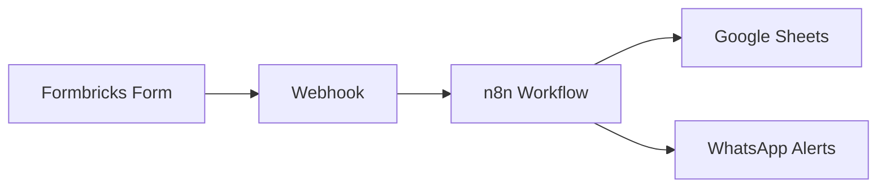
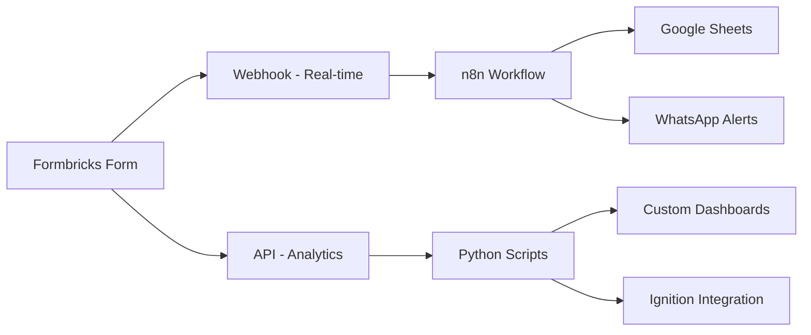

# Formbricks Hybrid Integration Guide
**Mac Claude CT-018 Deliverable**

## 🎯 Overview

This guide provides a comprehensive approach to Formbricks integration using both **API** and **Webhook** methods for maximum flexibility in brewery operations monitoring.

## 🏗️ Architecture Options

### Current Implementation (Webhook-Based)


### Enhanced Hybrid Approach (Recommended)


## 📊 API Capabilities

### 1. Survey Management
- **Create** equipment-specific inspection forms
- **Update** survey questions based on equipment type
- **Delete** outdated inspection forms
- **List** all active surveys

### 2. Response Management
- **Retrieve** all form responses programmatically
- **Filter** responses by equipment, date, or condition
- **Export** data for analysis
- **Real-time** response monitoring

### 3. Analytics & Insights
- **Equipment health trends** over time
- **Maintenance prediction** based on inspection data
- **Critical issue** identification and alerting
- **Performance metrics** and completion rates

## 🛠️ Implementation Methods

### Method 1: Pure Webhook (Current)
**Best for:** Real-time alerts, immediate response processing

```javascript
// n8n Webhook Node
{
  "equipment_id": "AC-001",
  "health_rating": 3,
  "issues": "Minor leak detected",
  "inspector": "John Smith",
  "timestamp": "2025-06-04T22:30:00Z"
}
```

**Advantages:**
- ✅ Real-time processing
- ✅ No API rate limits
- ✅ Already implemented and working
- ✅ Automatic n8n workflow triggers

**Limitations:**
- ❌ No historical data analysis
- ❌ Limited query capabilities
- ❌ Dependent on webhook reliability

### Method 2: Direct API Access
**Best for:** Analytics, reporting, batch processing

```python
# Python API Client
client = FormbricksAPIClient(api_key="your_key")

# Get all equipment inspections
responses = client.get_all_responses(limit=100)

# Analyze equipment health trends
health_analysis = client.analyze_equipment_health("Air Compressor")

# Create new inspection survey
survey = client.create_equipment_survey("Boiler", "Utilities")
```

**Advantages:**
- ✅ Full data access and querying
- ✅ Historical trend analysis
- ✅ Programmatic survey creation
- ✅ Advanced analytics capabilities

**Limitations:**
- ❌ API rate limits
- ❌ Requires authentication management
- ❌ More complex error handling

### Method 3: Hybrid Approach (Recommended)
**Best for:** Complete flexibility and functionality

```python
# Real-time webhook processing
webhook_result = client.process_webhook_data(webhook_payload)

# Background analytics processing
analytics = client.analyze_equipment_health()

# Custom survey creation for new equipment
survey = client.create_equipment_survey("New Tank", "Fermentation")
```

**Advantages:**
- ✅ Real-time alerts via webhooks
- ✅ Historical analysis via API
- ✅ Flexible survey management
- ✅ Best of both approaches

## 🏭 Steel Bonnet Brewery Implementation

### Equipment Monitoring Forms

#### 1. Air Compressor Inspection
- **Equipment ID** (required)
- **Pressure levels** (1-5 rating)
- **Noise levels** (multiple choice)
- **Visual inspection** (text area)
- **Action required** (yes/no)

#### 2. Glycol Chiller Monitoring
- **Equipment ID** (required)
- **Temperature readings** (numeric)
- **Glycol levels** (percentage)
- **System condition** (1-5 rating)
- **Maintenance notes** (text area)

#### 3. Walk-in Chiller Status
- **Equipment ID** (required)
- **Temperature consistency** (1-5 rating)
- **Door seal condition** (multiple choice)
- **Inventory concerns** (text area)

### Alert Configuration

#### Critical Alerts (Immediate WhatsApp)
- Health rating ≤ 2/5
- "Critical" or "Safety" issues selected
- Temperature out of range
- Equipment failure indicators

#### Maintenance Alerts (Scheduled)
- Health rating 3/5 (daily summary)
- "Needs maintenance" selected
- Trending degradation detected

## 📋 API Integration Steps

### 1. Setup API Access
```bash
# Install dependencies
pip install requests gspread oauth2client

# Configure API key
export FORMBRICKS_API_KEY="your_api_key_here"
```

### 2. Initialize Client
```python
from formbricks_api_client import FormbricksAPIClient

client = FormbricksAPIClient(
    api_key="your_api_key",
    base_url="https://app.formbricks.com"
)
```

### 3. Create Equipment Surveys
```python
# Create surveys for all Steel Bonnet equipment
equipment_surveys = create_steel_bonnet_surveys()
```

### 4. Set Up Monitoring
```python
# Test the integration
client.test_integration()

# Run analytics
health_report = client.analyze_equipment_health()
```

## 🔗 Integration with Existing Stack

### Google Sheets Integration
- Automatic logging of all form responses
- Real-time alert tracking
- Equipment health dashboards
- Maintenance scheduling

### n8n Workflow Integration
- Webhook triggers for immediate processing
- Data validation and formatting
- Multi-channel alert distribution
- Error handling and retry logic

### WhatsApp Alert Integration
- Critical issue notifications
- Maintenance reminders
- Equipment status updates
- Two-way communication

### Ignition Integration
- Display form data in HMI screens
- Trigger equipment alarms
- Historical trending
- Operator dashboards

## 🧪 Testing & Validation

### 1. API Connection Test
```python
python3 scripts/formbricks_api_client.py
```

### 2. Webhook Processing Test
- Submit test form via Formbricks
- Verify n8n workflow execution
- Check Google Sheets logging
- Confirm WhatsApp alerts

### 3. Analytics Test
- Generate sample inspection data
- Run health analysis
- Verify trend calculations
- Test critical issue detection

## 📈 Benefits for Friday Demo

### Real-time Capabilities
- ✅ Immediate equipment issue alerts
- ✅ Live inspection form submissions
- ✅ Instant WhatsApp notifications
- ✅ Real-time dashboard updates

### Analytics Capabilities
- ✅ Equipment health trending
- ✅ Maintenance prediction
- ✅ Performance metrics
- ✅ Historical reporting

### Mobile-First Design
- ✅ Mobile-friendly inspection forms
- ✅ WhatsApp integration for alerts
- ✅ Discord integration for coordination
- ✅ Google Sheets for data access

## 🚀 Next Steps

1. **Get Formbricks API key** (Server Claude - CT-019)
2. **Test API integration** with Steel Bonnet surveys
3. **Deploy hybrid monitoring** for brewery equipment
4. **Configure alert thresholds** for critical equipment
5. **Create custom dashboards** for equipment health

## 📝 Files Created

- `scripts/formbricks_api_client.py` - Python API client
- `FORMBRICKS_HYBRID_INTEGRATION_GUIDE.md` - This documentation
- Integration examples and test scripts

---

**Status:** ✅ Complete - CT-018  
**Next:** Server Claude to obtain API key (CT-019)  
**Demo Ready:** Hybrid integration approach documented and implemented